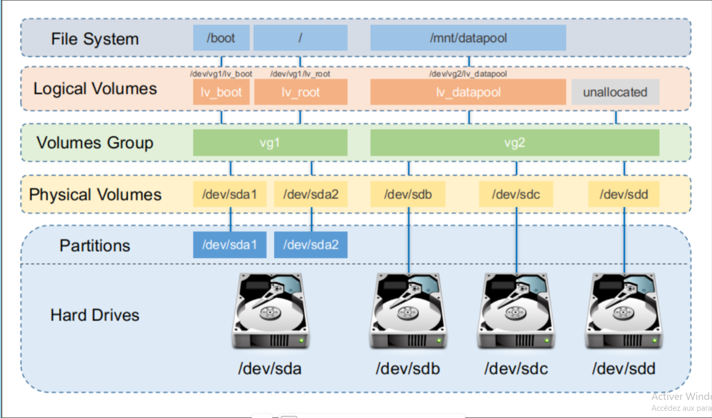

# Stockage/disque/partition

le format sur linux est ext4  

pvs (permet de visualiser les groupes et l'espace free)
lvs  

• pvcreate : création des volumes physiques ;
• vgcreate : création des groupes de volumes ;
• lvcreate : création des volumes logiques.  

fdisk → MBR (par défaut)  
gdisk → GPT  
parted → permet MBR ou GPT  

les partitions logiques sont par exemple home,root,swap,var...  

Pour créer une nouvelle partition logique de 20GB qui s'appelerait var : `lvcreate -n var -L 20G <groupe volume>`  

`lvextend -r -L +100%FREE </dev/group/partition>` (-r permet de faire un resize2fs directement, ils doivent être séparés cependant)  

## Créer une partition

`fdisk /dev/<disque>` > n > t (type)  

`vgextend <group> /dev/<partition>` : ajoute la partition au groupe

`resize2fs` pour étendre les données d'une partition /dev/mapper/GroupVolumeD12-home

`mkfs.ext4 -L VAR /dev/GroupeVolumeD12/var` : formate en ext4 /var et lui attribut le label VAR  

## Montage

`df -h` : permet de voir ce qui est monté

`du -ch -d 1 /`

mount
`mount -t ext4 /dev/mapper/GroupVolumeD12-var /mnt`

`/mnt` : montage temporaire
  
`/etc/fstab` : montage automatique