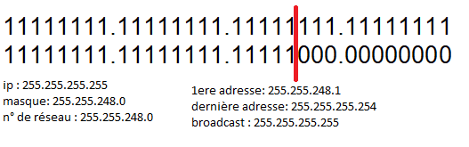

# Bases réseau 

## Switch (commutateur)

Les switch sont capables de mémoriser les MAC adresses

## MAC Adresse

Chaque carte réseau à une MAC adresse unique, c'est ce qui permet d'identifier un appareil ( qui possède une carte réseau )

## VLAN

Les __vlan__ permettent de segmenter le réseau.  
Les __vlan__ se configurent depuis les switch dits manageable.  
Un switch basique ne connait pas les vlan.  
Penser au mode __trunk__ entre les switch pour transporter des vlan d'un switch à un autre  

## TCP/IP

### Adresses IP

Adresse réseau = pair  
Adresse broadcast = impair  

Les adresses __IPv4__ sont toutes codées sur __4 octet__ , 1 octet = __8 bit__ donc une adresse IP c'est __32 bits__ séparés en 4 blocs de 8  
Exemple: 192.168.29.1  

1 bit = 0 ou 1  
Exemple: 1 octet = 00101010 (8bit)  
_En anglais 1 octet = 1 byte  
1 MB = 1Mo = MegaByte  
1 Mb = Méga bit_  

Pour convertir manuellement les IP, il faut connaitre le poids de chaque bit  
Ca commence par 1 jusqu'à 128 en doublant à chaque incrémentation 
Il suffit d'additionner tous les bits qui sont égaux à 1  

|  128  |  64   |  32   |  16   |   8   |   4   |   2   |   1   |
| :---: | :---: | :---: | :---: | :---: | :---: | :---: | :---: |
|   0   |   0   |   1   |   0   |   1   |   0   |   1   |   0   |
|   0   |   0   |  32   |   0   |   8   |   0   |   2   |   0   |

Dans cet exemple 00101010 = 42

Bon à savoir :  
- 11111111 = 255
- 00000000 = 0

Donc une IP est forcément entre 0.0.0.0 et 255.255.255.255

### Masque de sous réseau

Une adresse IP ne va jamais sans son __masque de sous réseau__  
Le __masque de sous réseau__ sert à calculer le numéro de réseau  
Pour que 2 machines puissent communiquer ensemble, il faut qu'elles aient le même numéro de réseau.

Pour calculer un masque de sous réseau manuellement, on utilise le __&__ (et logique)

Utilisation du & en binaire :
- 0&0 = 0
- 0&1 = 0
- 1&0 = 0
- 1&1 = 1

Il suffit "d'inverser" le tableau par exemple si on souhaite convertir 192 en binaire :

|  128  |  64   |  32   |  16   |   8   |   4   |   2   |   1   |
| :---: | :---: | :---: | :---: | :---: | :---: | :---: | :---: |
|   1   |   1   |   0   |   0   |   0   |   0   |   0   |   0   |
|  128  |  64   |   0   |   0   |   0   |   0   |   0   |   0   |

128 + 64 = 192  
donc 192 = 11000000

Cas pratique du & :

Grâce au tableau on sait que __192.138.29.1__ = 11000000.10001010.00011101.00000001  

192.138.29.1  
&255.255.255.0

on va comparer chaque binaire, par exemple pour 1le premier octet qui est 192

|       |       |       |       |       |       |       |       |       |       |
| :---: | :---: | :---: | :---: | :---: | :---: | :---: | :---: | :---: | :---: |
|       |  192  |   1   |   1   |   0   |   0   |   0   |   0   |   0   |   0   |
|   &   |  255  |   1   |   1   |   1   |   1   |   1   |   1   |   1   |   1   |
|   =   |  192  |   1   |   1   |   0   |   0   |   0   |   0   |   0   |   0   |

Si le sous masque est 255 alors le resultat sera le même que l'IP (ex: 192&255 = 192)  
Si le sous masque est 0 alors le resultat est 0 (ex 1&0 = 0)

donc le __numéro de réseau__ de l'adresse IP 192.138.29.1 et du masque de sous réseau 255.255.255.0 est 292.138.29.0

On peut écrire le masque de sous réseau avec la notation __CIDR__ 

192.168.29.1/24

Dans les plages d'IPs , il y'a 2 IP qui ne sont pas disponibles : la première qui est le __numéro de réseau__ et la dernière qui est le __broadcast partiel__

Le __broadcast partiel__ va toucher tous les ordinateurs qui ont le même numéro de réseau

L'adresse de Broadcast = 255.255.255.255 (dernière adresse possible)
L'adresse de Broadcast partiel = la dernière adresse théorique (ex: 192.168.29.255)
(en gros la dernière adresse disponible)

Unicast = 1 destinataire
Broadcast = tous les ordinateurs du réseau

Voici un tableau pertinent qui montre les IP de la notation CIDR 8 à 30  

( mnémotechnique : on fait -x qu’on multiplie par 2 à chaque fois qu’on enlève 
un 0 exemple : 255 -1 = 254 puis 254 -2 = 252 puis 252 – 4 = 248 etc )  

NB: grâce à la technique du trait(écrire l'ip et le masque en binaire et tracer un trait à partir du dernier 1 du masque de sous réseau) :  

- pour calculer le n° de réseau à droite du trait que des 0 dans l'adresse IP
- pour le broadcast partiel à droite du trait que des 1 dans l'adresse IP  

  

#### Comment partager son réseau  ?

On peut faire plusieurs sous réseaux à partir d'un même masque.  

Ex : Notre entreprise dispose de la plage 192.168.1.0/24 on souhaite diviser le réseau en 2 parties équitables.  

On va utiliser le masque __192.168.1.0/25__  
Réseau 1 : 192.168.1.0 > 192.168.1.128  
Réseau 2 : 192.168.1.129 > 192.168.1.255  

Comment partager à partir d'une plage :
On décalle le bit du masque ex:  
- on souhaite 2 sous réseaux, on décalle de 1  
- on souhaite 4 sous réseaux, on décalle de 2  
- on souhaite 8 sous réseaux, on décalle de 3  

 

 Un réseau /30 est un réseau dit "point à point" (il ne contient que 2ip pour les hotes)

## Routing

TODO

## Rôles

Le serveur __DHCP__ (Dynamic Host Configuration Protocol) permet d’attribuer dynamiquement des paramètres TCP/IP aux périphériques qui en font la demande. 

Le serveur __DNS__ (Domain Name System) fournit un service de résolution de noms en adresses IP et réciproquement.

__NAS__ (Network Attached Storage) définit un environnement permettant l’accès à du stockage au travers du réseau (Ethernet).
